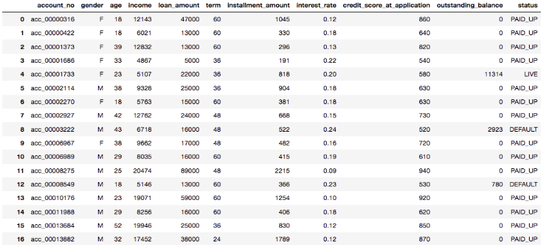
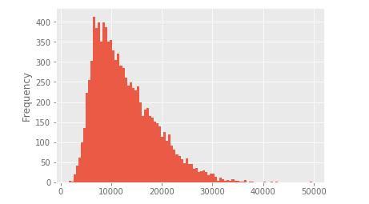

Credit Book Valuation Recruitment Task
======================================

This is a hiring task for the position of **data scientist** at RelyComply.

The goal of this task is to fit a statistical model to historical credit data and then use the model to estimate the value of current loans. The task is broken up into five steps which are explained in detail below.

This is a relatively straightforward task and should not take you too long to complete. We would like you to complete the task using a python notebook and a number of commonly-used data science libraries. We would like you to demonstrate that you have some familiarity with some core concepts in data science and that you either are familiar enough with the particular technologies or can use online resources to become familiar enough to solve the task. Within these parameters there are still many ways to solve the task. If necessary you can make (and note) assumptions about the data and the interpretation of the task.

The first step sets up the environment that we would like you to use to solve the task. The remaining steps take you through the process of building, evaluating and using the model to solve the task.

**1. Install Anaconda and Launch Jupyter Notebook**

If you do not already have Anaconda download and install it (https://www.continuum.io/downloads). Launch a Jupyter Notebook (either from Anaconda Navigator if you have it installed or from the terminal or command prompt with the command jupyter notebook). Create a new notebook which you will use for this task. You will submit this notebook as your solution after completing the task. You can add any notes and assumptions to this notebook.

**2. Load the data and explore relationships**

Load the supplied comma-separated data file (https://github.com/relycomply/credit-modelling-task/blob/master/data_science_task.csv) using pandas read_csv function - https://pandas.pydata.org/pandas-docs/stable/generated/pandas.read_csv.html

The imported dataframe should look something like this:

Each line in the dataset represents a loan. Each loan has the following fields:
* account_no - A unique account number per loan
* gender - The gender of the account holder - either ‘M’ or ‘F’
* age - The age of the account holder at the point of application
* income - The monthly nett income of the account holder at the point of application
* loan_amount - The amount of money lent
* term - The number of months that the loan is to be repaid over
* installment_amount - The monthly installment amount
* insterest_rate - The interest rate on the loan
* credit_score_at_application -The credit score at the point of application, this is a positive integer less than 1000. The higher the score the more creditworthy the applicant is believed to be.
* outstanding_balance - The remaining amount of the loan that still has to be repaid
* status - This indicates what state the account is in. This field can take one of three values 
   * “LIVE”: The loan is still being repaid - the field outstanding_balance will be greater than zero.
   * “PAID_UP”: The loan has been completely repaid - the field outstanding_balance will be zero.
   * “DEFAULT”: The loan was not fully repaid and no further payments can be expected - the field outstanding_balance will be greater than zero and the amount will not be recoverable.

In order to get a sense of the distribution of the fields and the relationships between the fields make some plots using the pandas dataframe plot function  - https://pandas.pydata.org/pandas-docs/stable/generated/pandas.DataFrame.plot.html 

An example plot could be a histogram of a particular field (such as the histogram of income plotted below) or a scatter plot to indicating the relationship between variables. Don’t spend too long on these plots, they needn’t be beautiful nor do they need to be exhaustive. The idea is simply to demonstrate that you can visualize relationships in the dataset.

**3. Fit a probabilistic classification model**

Separate the data into two data sets a current and a historical data set. Use the status field to do this, historical data has status “PAID_UP” or “DEFAULT” current data has the status “LIVE”. 

Using a probabilistic classification algorithm of your choice from scikit-learn (http://scikit-learn.org/), fit a probability of default model to the historical data. 

In order to evaluate this model (the next step) you will need to create a backtesting or hold-out set which you will not use to fit the model with. You can do this using scikit-learn’s model_selection package or using your own method.

You will need to decide how to encode the categorical fields in the data - you can use pandas get_dummies or the label and one hot encoders from scikit-learn.

Importantly note that you must not use the outstanding_balance field as one of the predictors as this field is by definition perfectly correlated with the default variable you are trying to predict.

**4. Evaluate your model**

Choose a suitable evaluation metric from scikit-learn’s metrics package. Use your fitted model to predict the probabilities of default for the test data set. Use the scikit-learn functionality to calculate the metric based on the actual test set outcomes and the predicted test set outcomes.

**5. Use model to forecast value of book**

Finally, use your fitted model to predict the probability of default for each of the loans in the current dataset. Use this probability to calculate the expected repayment amount for each loan (this is just one minus the predicted probability of default multiplied by the outstanding_amount). In this calculation you can disregard any impact of the time value of money. 

Sum all the expected repayment amounts to find the total expected value of the book. 

You can verify that this total repayment amount roughly reflects the average default rate observed in the historical data by computing the ratio of the expected value to the sum of the outstanding_amount and comparing it to the proportion number of “PAID_UP” to the number of “DEFAULT” accounts in the historical data set.

### Submission

Download your notebook (or simply find the .ipynb file it on your file system). Submit your notebook back in an email. Do not fork the repository, please - don't want others to copy you're beautiful work.
